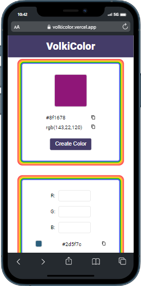

# React volkicolor :

### Proje özeti :

> Proje React ile yazıldı temel amaç renk üretmek

### Proje durumu ve yapılacaklar :

- [x] renk üretme
- [x] üretilen rengin rgb ve hex kodunu verme
- [x] üretilen rengin kodunu kopyalama
- [x] rgb to hex
- [x] hex to rgb
- [x] responsive tasarım

### Projede kullanılan Teknolojiler ve Metotlar :

> Projede useState, useEffect hook kullanıldı.
> stilendirme için herhangi bir kütüphane kullanılmadı pure css ile stilendirme yapıldı.
> deploy için vercel kullanıldı.

### proje font ve renk:

(font-family: 'Roboto', sans-serif;)
(background-color: #FFFFFF;)
(App background-color: #443C68;)

### Proje Adresi

[volkicolor](https://volkicolor.vercel.app/)

### Projenin Görselleri:

